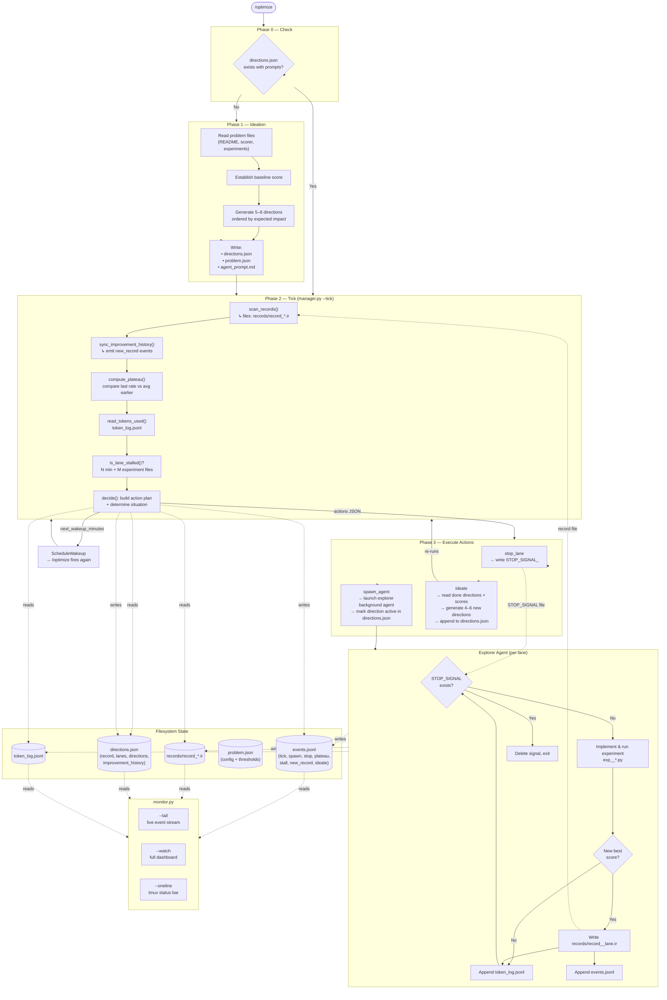
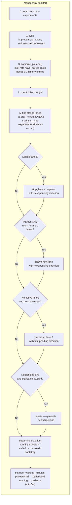
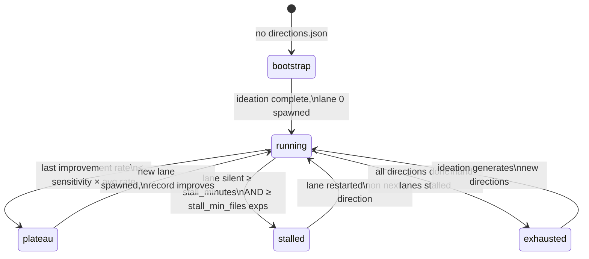

# SutroAna

Agent optimization loop and manager infrastructure for [sutro-problems](https://github.com/cybertronai/sutro-problems).

## The Core Idea

Most optimization work looks like this: you have an idea, you implement it, you score it, you look at the result, and you decide what to try next. That loop is bottlenecked by you — your attention, your time, and how quickly you can context-switch between thinking and coding.

SutroAna replaces the human in that loop with Claude.

The method is: give Claude a problem with a scorer (something that returns a number), and let it run the full explore-evaluate-redirect cycle autonomously. You watch. When it gets stuck or runs out of ideas, it generates new ones. When a lane stalls, it kills it and tries a different angle. When progress plateaus, it opens a second lane to pursue a parallel direction. The loop runs until the budget is spent or the problem is solved.

**Why this works with Claude specifically:**

Claude can do all the parts of the loop that used to require you:
- Read a codebase and understand the cost model
- Propose concrete, non-obvious optimization directions
- Implement an experiment, run it, interpret the result
- Decide whether to iterate or pivot
- Write structured observations so the next agent has context

The harness just scaffolds the memory (what's been tried), the routing (which agent works on what), and the signals (when to stop, when to spawn more). Claude does the actual research.

**Why you want a harness at all:**

Without one, a single Claude session hits context limits, loses track of what it tried, and can't parallelize. The harness gives Claude persistent state across wakeups, independent lanes that don't interfere, and a feedback signal (the scorer) it can trust over raw intuition. It turns a single-shot conversation into a long-running research process.

## What it does

Runs an autonomous optimization loop over any problem that has a scorer:
- If no directions exist yet, **ideates** — analyzes the problem and proposes concrete directions to try
- Launches explorer agents that implement and score ideas
- Detects stalls and redirects agents to the next direction automatically
- Tracks the record history and direction queue

## Usage

```bash
# Start or continue the optimization loop for a problem
/optimize ../sutro-problems/matmul

# Watch progress in the terminal
python3 monitor.py ../sutro-problems/matmul --watch

# CLI state utilities
python3 manager.py ../sutro-problems/matmul --status
python3 manager.py ../sutro-problems/matmul --finish <direction-id> --score <cost>
python3 manager.py ../sutro-problems/matmul --stop
python3 manager.py --list --root ../sutro-problems
```

## How a problem is defined

Each problem folder needs:

| File | Purpose |
|------|---------|
| `problem.json` | Config: record glob, cost pattern, baseline, stall thresholds |
| `directions.json` | Direction queue with prompts embedded per entry |
| `agent_prompt.md` | Base context injected into every explorer agent prompt |

If `directions.json` is missing or empty, `/optimize` runs an **ideation phase**
first — reads the problem, establishes a baseline, and generates the direction queue.

## Loop Overview

```
User → /optimize <problem>
         │
         ▼
   ┌─────────────┐
   │  Phase 0    │  Read directions.json
   │  Check      │  Has directions with prompts?
   └──────┬──────┘
          │ No                  Yes
          ▼                      ▼
   ┌─────────────┐        ┌─────────────┐
   │  Phase 1    │        │  Phase 2    │
   │  Ideation   │───────▶│    Tick     │
   └─────────────┘        └──────┬──────┘
                                 │
                          manager.py --tick
                          returns action plan
                                 │
                          ┌──────▼──────┐
                          │  Phase 3    │
                          │  Execute    │
                          └─────────────┘
```

## Full Loop



## Manager Decision Logic



## Situation State Machine



## Key Files

| File | Owner | Purpose |
|------|-------|---------|
| `problem.json` | human / ideation | Config: globs, thresholds, budget |
| `directions.json` | manager | Queue of directions + lane state + improvement history |
| `agent_prompt.md` | ideation | Base context injected into every explorer prompt |
| `events.jsonl` | manager + explorers | Structured event log (tick, spawn, stop, record, plateau…) |
| `token_log.jsonl` | explorers | Per-experiment token usage |
| `records/record_*.ir` | explorers | Best solutions found, cost encoded in filename |
| `exp_<lane>_*.py` | explorers | Experiment files (activity signal for stall detection) |
| `STOP_SIGNAL_<lane>` | manager | Tells a running explorer to halt and exit |

## Directory layout

```
SutroAna/
  manager.py                  # CLI state utility
  monitor.py                  # read-only progress dashboard
  .claude/
    skills/
      optimize/
        SKILL.md              # /optimize skill — the manager logic
```

## Related repos

- [sutro-problems](https://github.com/cybertronai/sutro-problems) — problem definitions
- [SutroYaro](https://github.com/cybertronai/SutroYaro) — sparse parity research workspace
